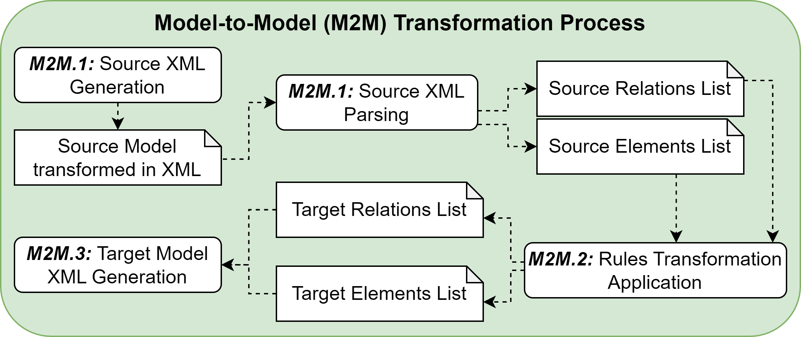

# Model-To-Model Transformation Tool

The Model-to-Model transformation process of the Model-Driven Architecture methodology, consists of four distinct sub-steps. The following diagram illustrates the **Model-to-Model (M2M) transformation process**, where the rounded boxes represent the activities involved, and the note symbols indicate the data generated at each step, which subsequently serves as input for the next step. 

The transformation process begins by converting the source model into an XML format (**M2M.1**). 
This step can be automatically executed using modeling tools such as Visual Paradigm. 
The Source XML file is then parsed by a custom-built parser to extract the list of source elements and relationships (**M2M.2**). 
In the next step (**M2M.3**), transformation rules are applied to generate the elements and relationships of the target model. 
Finally, step **M2M.4** structures the target elements and relationships into a target model represented in XML format that can be easily imported into modeling tools for visualization.

This transformation process is designed to function independently of the specific source and target models, 
allowing it to transform both the Computational Independent Model (CIM) to the Platform Independent Model (PIM) and 
the PIM to the Platform Specific Model (PSM). These are the models within the Model-Driven Architecture methodology. 
In the first scenario, the CIM serves as the source model and the PIM as the target model, while in the second, the PIM is the source model and the PSM is the target model.

